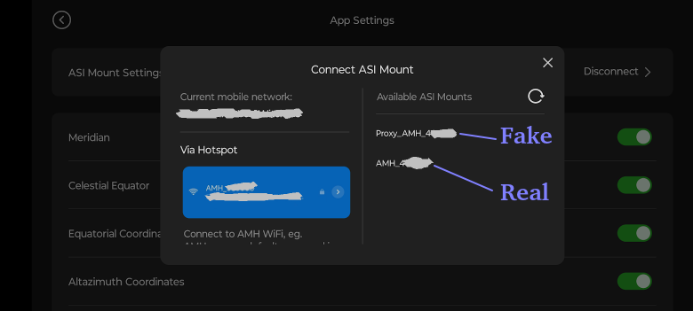
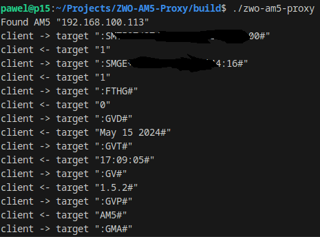

# ZWO AM5 Proxy
The program was created to check the command set for the ZWO AM5 mount.
This mount is based on the LX200 Command set in communication via serial port and wifi.
Unfortunately, the information available on the Internet is insufficient.

If you run this application in the network where the ZWO AM5 mount is located, on an application such as StarGazing,
a virtual mount will appear, which will display all communication between.

You can find sample commands in the file `example-am5.log`.

### Building & Run
```sh
git clone https://github.com/pawel-soja/ZWO-AM5-Proxy
cd ZWO-AM5-Proxy

mkdir build
cd build

qmake ..
make -j4

./zwo-am5-proxy
```

### Example of a running program




